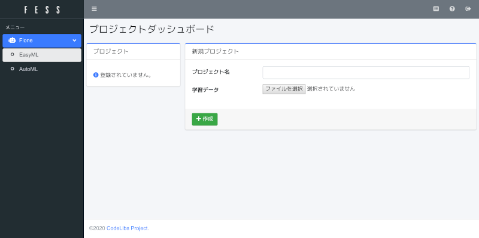
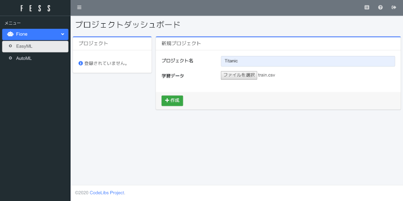
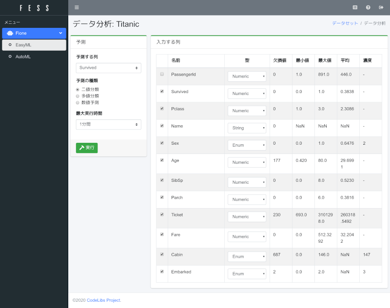
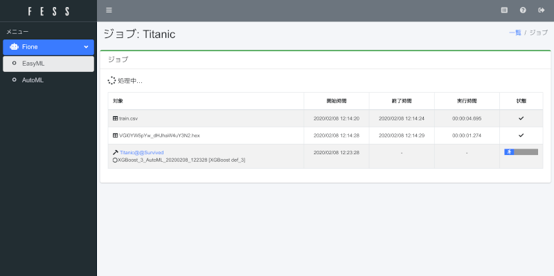
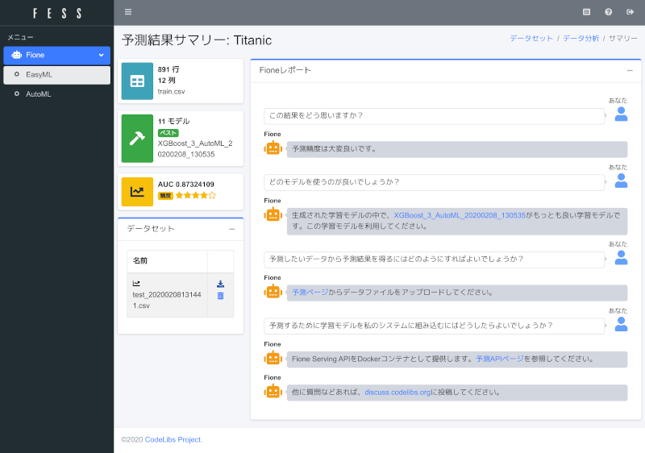
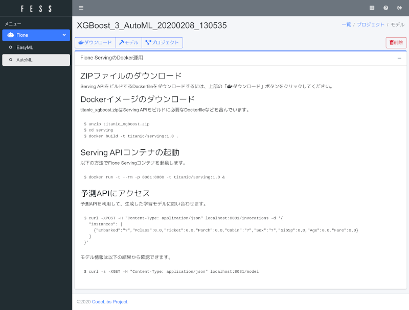

================
クイックスタート
================

事前準備
========

事前に以下のソフトウェアをインストール済みである必要があります。

* `Docker <https://docs.docker.com/get-docker/>`_
* `Docker Compose <https://docs.docker.com/compose/>`_

Fioneの起動
===========

FioneのDocker環境を取得して、起動します。

.. code-block:: bash

   $ git clone https://github.com/codelibs/docker-fione.git
   $ cd docker-fione/compose
   $ docker-compose up

ログイン
========

\http://localhost:8080/admin/easyml/ にアクセスして、fioneユーザーでログインします。
デフォルトのパスワードはfioneです。
(管理者でログインする場合はadmin/adminでログインできます)

|image0|

fioneユーザーでログインすると、EasyMLのプロジェクトダッシュボードが表示されます。

|image1|

データセットの準備
==================

今回は、Kaggleの機械学習の基本的なタスクである `Titanic <https://www.kaggle.com/c/titanic>`_ のデータセットを利用します。
Dataページからtrain.csvとtest.csvをダウンロードしてください。
ダウンロードするためにはKaggleへのユーザー登録が必要になります。

このデータは性別や年齢などと生存したか?(Servived)の情報が含まれており、Servived(0 or 1)を予測するタスクになります。

プロジェクトの作成
==================

データセットの準備ができたら、Fioneに戻り、EasyMLのプロジェクトダッシュボードでプロジェクトを作成します。
今回はプロジェクト名に「Titanic」、学習データにtrain.csvを入力して、作成ボタンを押下してください。

|image2|

学習データの読み込みが終わると、データ分析ページが表示されます。

|image3|

学習に利用するデータ(列)を選択して、予測する列と種類を入力します。
最大実行時間はデフォルトでは1時間ですが、最大時間が長ければ、その時間内でさまざまな学習アルゴリズムを実行して、より精度が高いモデルを見つけようとします。

今回は、予測する列に「Survived」、予測する種類は0または1なので「二値分類」、最大実行時間は「1分間」にします。
(時間がある方は、最大実行時間をより長い時間にしてください)
実行ボタンを押下して、学習処理を開始します。

|image4|

学習アルゴリズムの実行にはCPUを消費します。
消費するメモリも対象データが多いほどより使用されます。
学習処理が終わると、サマリーページが表示されます。

|image5|

学習モデルは複数生成されますが、その中でもっとも良いものをFione君が教えてくれます。
精度については、星の数で左側に表示されます。
精度が悪い場合は、右上のデータ分析リンクから最大実行時間を長くして学習の実行をやり直してください。

テストデータの予測
==================

学習モデルができたので、次にその学習モデルを利用してテストデータにSurvivedの予測値を付加してみましょう。

Fione君のコメントにある「予測ページ」のリンクを押下してください。
テストデータのアップロード画面が表示されます。

|image6|

予測するデータに「test.csv」をセットして、アップロードボタンを押下してください。
処理が終わると、サマリーページにデータセット一覧が表示されます。
ダウンロードアイコンをクリックすると、predict列に予測値が含まれたCSVファイルがダウンロードできます。

|image7|

Dockerで予測APIの利用
=====================

Fioneは生成した学習モデルを簡単に利用できるように、Dockerの予測APIコンテナを提供しています。
予測APIを利用するには、Fione君のコメントにある「予測APIページ」のリンクを押下してください。

Fione Servingの利用方法が記述されたページが表示されます。

|image8|

その手順に従い、ZIPファイルをダウンロードして、docker buildをしてください。

.. code-block:: bash

   $ unzip titanic_xgboost.zip
   $ cd serving
   $ docker build -t titanic/serving:1.0 .
   $ docker run -t --rm -p 8081:8080 -t titanic/serving:1.0 &

予測APIがlocalhost:8081で利用できるようになるので、適当なデータを以下のように投げると、labelの値として予測値が返却されます。

.. code-block:: bash

   $ curl -XPOST -H "Content-Type: application/json" localhost:8081/invocations -d '{
     "instances": [
       {"Embarked":"Q","Pclass":3.0,"Ticket":0.0,"Parch":0.0,"Sex":"male","SibSp":0.0,"Age":34.5,"Fare":7.8292}
     ]
   }'
   {"predictions":[{"label":"0","index":0,"class_probabilities":[0.8350488543510437,0.1649511456489563]}]}

docker runをバックグラウンドで実行しているので、終了する際にはfgを実行してからCtrl-cで終了してください。

Fioneの停止
===========

Fioneを停止するには以下のコマンドを実行します。

.. code-block:: bash

   $ docker-compose down

Dockerボリュームにもデータが保存されているので、完全に削除するためには以下のコマンドを実行します。

.. code-block:: bash

   $ docker volume rm fess-data es-data es-dict minio-data

.. |image0| image:: ../resources/images/ja/quickstart_login.png

.. |image5| image:: ../resources/images/ja/quickstart_easyml_summary.png
.. |image6| image:: ../resources/images/ja/quickstart_easyml_testcsv.png

