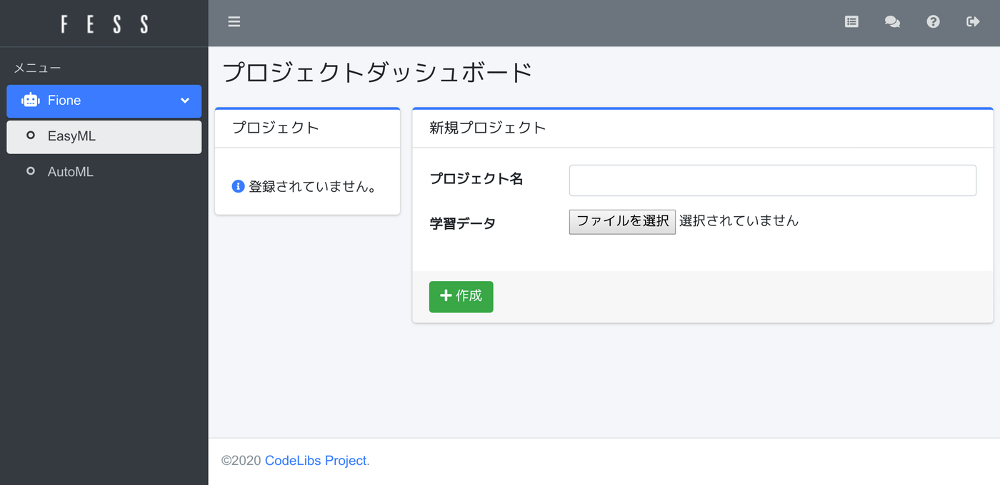
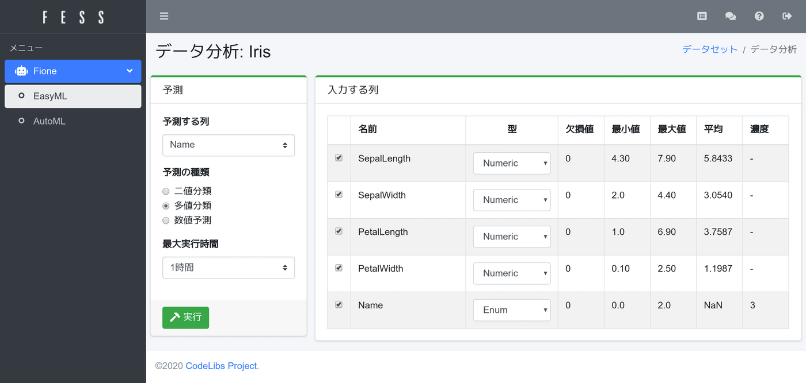
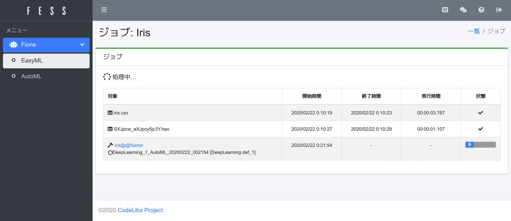
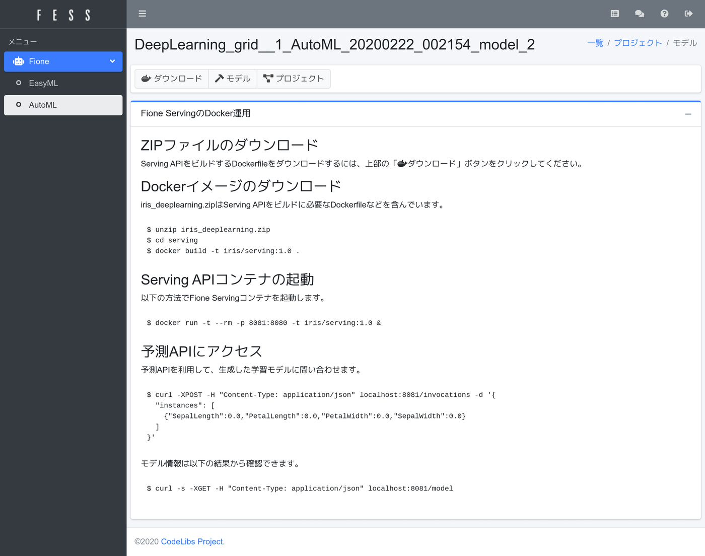

=============================
Fioneではじめる機械学習〜導入
=============================

はじめに
--------

近年、機械学習やデータサイエンスは身近な手段の一つになってきているかと思います。
とはいえ、まだまだ専門知識などがないと、予測モデルを作って、開発しているシステムに組み込んだり、実際に利用するにはいろいろな課題があります。

そこで、機械学習やデータサイエンスの知識や経験がなくても、高度な予測モデルの作成や様々な自動化を実現するためのプラットフォームである\ `Fione <https://fione.codelibs.org/ja/>`__\ を紹介します。

Fioneとは
---------

`Fione <https://fione.codelibs.org/ja/>`__ (フィオネ) は「簡単に機械学習をできるサーバー」です。
機械学習の専門知識がなくても、データをアップロードして、簡単な設定で機械学習を実行するだけで、予測モデルを生成することができます。
また、その予測モデルをDockerで予測API化もできるので、ご利用のシステムに組み込んで利用することなどもできます。
FioneはApacheライセンスで提供されるオープンソースのプロダクトです。

対象ユーザー
~~~~~~~~~~~~

Fioneの目指すところとしては、誰でも機械学習を簡単に利用できるようにする、というところになります。
ですので、機械学習の専門家であってもなくても、

-  機械学習の知識や経験なし：ブラウザ上でポチポチ進めるだけで、予測モデルが作成でき、予測結果を取得することができる
-  機械学習の知識や経験あり：とりあえず、Fioneで実行して、ベースラインの予測精度を知るなど(その情報を元に別途開発する)

というような利用方法も考えられるので、幅広いユーザーで利用できると思います。

学習アルゴリズム
~~~~~~~~~~~~~~~~

Fioneは機械学習ロジックには\ `H2O <https://github.com/h2oai/h2o-3>`__\ を採用しています。
H2Oは機械学習分析プラットフォームで、様々な学習アルゴリズムが含まれています。
世界のトップレベルのデータサイエンティストたちが開発に加わっており、そのナレッジが反映されていると思います。
FioneではH2OのAutoMLの機能を利用して、高精度の学習モデルを生成しています。

その他
~~~~~~

Fioneは\ `github.com/codelibs/fione <https://github.com/codelibs/fione>`__\ 上で開発されています。
Dockerでの提供になるので、\ `github.com/codelibs/docker-fione <https://github.com/codelibs/docker-fione>`__\ で提供されています。
Fioneは全文検索サーバ\ `Fess <https://fess.codelibs.org/ja/>`__\ の拡張機能として作られ(現時点では検索機能とは連携していない)、データの保存先に\ `MinIO <https://github.com/minio/minio>`__\ を利用しています。
Fioneではそれらをまとめて、docker-composeも提供しているので、DockerおよびDocker Composeの実行環境があれば、コマンド一つで利用することができます。

Fioneはオープンソースで開発されているので、修正した内容を気軽にプルリクなどして開発に参加することもできます。

Fioneで機械学習
---------------

では、早速、Fioneを試していきましょう。

今回は、定番データともいえる、irisデータ(\ `iris.csv <https://raw.githubusercontent.com/codelibs/fione/fione-13.6.0/src/test/resources/data/iris.csv>`__)を利用します。
iris(植物のあやめ)のデータはセトナ(setosa)、バーシクル(versicolor)、 バージニカ(virginica)という3種類のあやめのどれかで、がく片長(Sepal
Length)、がく片幅(Sepal Width)、花びら長(Petal Length)、花びら幅(Petal Width)の4つの属性情報から構成されます。
ですので、4つの属性情報だけを見て、あやめの種類を予測するモデルを作成します。

事前準備
~~~~~~~~

Fioneを実行するためには以下のソフトウェアをインストールする必要があります。

-  `Docker <https://docs.docker.com/get-docker/>`__
-  `Docker Compose <https://docs.docker.com/compose/>`__
-  `システムの設定 <https://fione.codelibs.org/ja/quick-start.html#id3>`__

Fioneの起動
~~~~~~~~~~~

GitHubからFioneのDocker環境を取得して、起動します。

::

    $ git clone https://github.com/codelibs/docker-fione.git -b v13.6.0
    $ cd docker-fione/compose
    $ docker-compose up

利用可能な最新バージョンについては\ `リリース一覧 <https://github.com/codelibs/docker-fione/releases>`__\ を確認してください。

以下のようなエラーが出る場合は、\ `ここ <https://www.elastic.co/guide/en/elasticsearch/reference/current/docker.html#_set_vm_max_map_count_to_at_least_262144>`__\ を参考にして、設定値を変更してください。

::

    es01       | [1]: max virtual memory areas vm.max_map_count [65530] is too low, increase to at least [262144]

ログイン
~~~~~~~~

ブラウザで ``http://localhost:8080/admin/easyml/`` にアクセスして、fioneユーザーでログインします。
デフォルトのパスワードはfioneです。
(管理者でログインする場合はadmin/adminでログインできます)

fioneユーザーでログインすると、EasyMLのプロジェクトダッシュボードが表示されます。

|image0|

プロジェクトの作成
~~~~~~~~~~~~~~~~~~

irisデータを利用して、EasyMLのプロジェクトダッシュボードでプロジェクトを作成します。
今回はプロジェクト名に「Iris」、学習データにiris.csvを設定して、作成ボタンを押下してください。

学習データの読み込みが終わると、データ分析ページが表示されます。

|image1|

左側に予測したい情報が表示され、右側には予測するために入力する内容が表示されます。

今回はあやめの種類を予測したいので、左側の予測する列には「Name」を選択します。
あやめの種類は3種類なので、「多値分類」を選択します。
予測モデルの作成は指定した時間内で様々なアルゴリズムを実行するため、最大実行時間で予測モデル群の作成に使う計算時間を指定します。
今回は「1時間」を選択します。最大時間が長ければ、その時間内で様々な学習アルゴリズムを実行して、より精度が高いモデルを見つけようとします。

入力する列については、予測するときに入力する値を指定します。
不要な入力データは除外します。
Nameも選択しておいても、予測値は入力する列からは除外されるので、選択してもしなくてもどちらでも問題ありません。
今回は全部を選択状態にしておきます。

実行ボタンを押下して、学習処理を開始します。(時間がかかります…)

|image2|

学習アルゴリズムの実行にはCPUやメモリを消費します。
消費するメモリも対象データが多いほどより使用されます。
学習処理が終わると、サマリーページが表示されます。

|image3|

学習モデルは複数生成されますが、その中でもっとも良いものをFione君(図中の黄色いロボット)が教えてくれます。
今回の実行では3299個の予測モデルを作成しています。
精度は、星の数で左側に表示されます。
今回の予測モデルの精度は高いので、星5つになっています。
(注：会話風な表示をしているだけで、Fione君がチャット的に答えてくれるわけではありません…)

Dockerで予測API
~~~~~~~~~~~~~~~

Fioneでは、テストデータをアップロードして結果を取得するなどもできますが、今回は予測APIの使い方を紹介します。

Fioneは生成した学習モデルを簡単に利用できるようにするため、Dockerの予測APIコンテナを提供しています。
このDockerを利用すれば、自社のサービスに組み込んで利用したりなども簡単に実現できます。
予測APIを利用するには、Fione君のコメントにある「予測APIページ」のリンクを押下してください。

Fione Servingの利用方法が記述されたページが表示されます。

|image4|

その手順に従い、ZIPファイルをダウンロードして、docker buildをしてください。
(精度が良かったモデルの種類によって、ファイル名は異なる可能性があります)

::

    $ unzip iris_deeplearning.zip
    $ cd serving
    $ docker build -t iris/serving:1.0 .
    $ docker run -t --rm -p 8081:8080 -t iris/serving:1.0

予測APIがlocalhost:8081で利用できるようになるので、適当なデータを以下のように投げると、labelの値として予測値が返却されます。

::

    $ curl -XPOST -H "Content-Type: application/json" localhost:8081/invocations -d '{
      "instances": [
        {"SepalLength":7.0,"PetalLength":3.2,"PetalWidth":4.7,"SepalWidth":1.4}
      ]
    }'
    {"predictions":[{"label":"Iris-virginica","index":2,"class_probabilities":[2.912415171008355E-18,2.707784885487982E-18,1.0]}]}

このように予測APIもDockerで利用できるようになるので、他のシステムの連携して簡単に利用することができます。

Fioneの停止
~~~~~~~~~~~

最後に、Fioneを終了する場合は、以下のコマンドをdocker-compose upを実行したディレクトリで実行します。

::

    $ docker-compose down

Dockerボリュームにもデータが保存されているので、完全に削除するためには以下のコマンドを実行します。

::

    $ docker volume rm fess-data es-data es-dict minio-data

まとめ
------

Fioneを利用することで、コードを書かないでも高い精度の予測モデルを取得して、予測APIの構築までできてしまうのを紹介できたと思います。
AIの専門家でなくても、実用的な予測モデルを利用できるようになりますし、専門家であれば、とりあえず、Fioneで実行して、結果を見て、より良いモデルを構築するヒントを得られるかもしれません。

Fioneは2019年末から開発されている新しいオープンソースのプロダクトであり、まだまだ課題や改善点があったり、拡張されていくと思います。
オープンソースで自由に利用できますし、質問や要望などがあれば、\ `フォーラム <https://discuss.codelibs.org/c/FioneJA/>`__\ を利用することができます。

